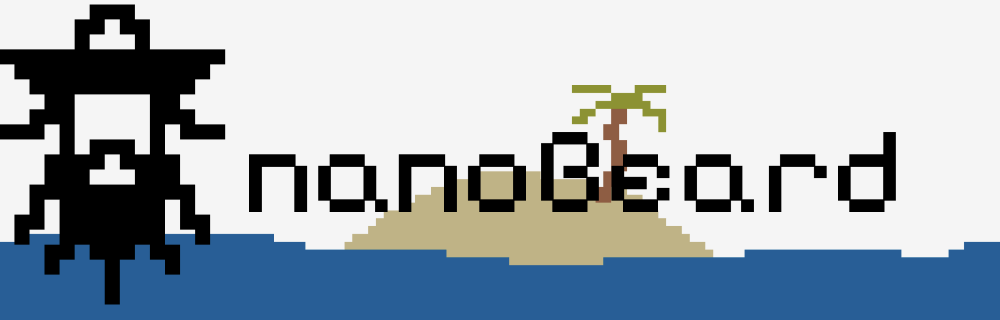

# nanoBeard ☠️

A tiny pirate-themed GPT trained from scratch on a piratized version of TinyStories,
then SFT-tuned. Built as a learning project — closer to nanoGPT than to a production LM.

| Codename | Params | HF repo |
|---|---|---|
| **Sloop** (v1) | ~13.8M | [`younissk/nanoBeard-sloop-14M`](https://huggingface.co/younissk/nanoBeard-sloop-14M) |
| **Galleon** | ~33.8M | [`younissk/nanoBeard-galleon-34M`](https://huggingface.co/younissk/nanoBeard-galleon-34M) |
| **Frigate** (v2) | ~126M / ~358M | [`younissk/nanoBeard-frigate-125M-GGUF`](https://huggingface.co/younissk/nanoBeard-frigate-125M-GGUF) · [`-360M-GGUF`](https://huggingface.co/younissk/nanoBeard-frigate-360M-GGUF) |

Source: https://github.com/younissk/pirate_llm

## Model details (Sloop, v1)

| Field | Value |
|---|---|
| Architecture | Decoder-only Transformer (GPT-style) |
| Parameters | ~13.8M |
| Layers / heads / embd | 6 / 6 / 384 |
| Context length | 256 tokens |
| Vocab size | 8192 (custom BPE) |
| Bias in Linear/LN | False |
| Tokenizer | `pirate_bpe.json` (HuggingFace `tokenizers` BPE) |

## Training

- **Pretraining** on piratized TinyStories.
- **SFT** on `TeeZee/dolly-15k-pirate-speech` (+ `Estwld/empathetic_dialogues_llm`
  for the multi-turn Frigate models).
- AdamW, warmup + cosine decay. `bfloat16` on CUDA.
- See `training_metadata.json` in this repo for the exact run config + losses.

## Loading

`nanoBeard` is **not** a `transformers` model — load via the `nanobeard` package:

```python
import json, torch
from huggingface_hub import hf_hub_download
from safetensors.torch import load_model
from tokenizers import Tokenizer

from nanobeard.config import Config
from nanobeard.models import build_model

repo = "younissk/nanoBeard-sloop-14M"
cfg_dict = json.load(open(hf_hub_download(repo, "config.json")))
cfg = Config(**{k: v for k, v in cfg_dict.items() if k in Config.__dataclass_fields__})
model = build_model(cfg).eval()
load_model(model, hf_hub_download(repo, "model.safetensors"))

tok = Tokenizer.from_file(hf_hub_download(repo, "pirate_bpe.json"))
ids = torch.tensor([tok.encode("Once upon a time").ids])
with torch.no_grad():
    for _ in range(80):
        logits, _ = model(ids[:, -cfg.block_size:])
        next_id = torch.multinomial(torch.softmax(logits[:, -1] / 0.8, -1), 1)
        ids = torch.cat([ids, next_id], dim=1)
print(tok.decode(ids[0].tolist()))
```

The Frigate GGUF builds need no Python at all — they load with upstream
llama.cpp under the `qwen3` arch.

## Limitations

- Trained on a tiny synthetic corpus. Vocabulary, grammar, and world knowledge
  are extremely narrow.
- Short context (256 tokens on Sloop).
- No safety tuning. Pirate-flavored nonsense at best.
- Educational artifact, not a useful chat model.

## Data

- Base corpus: [TinyStories](https://huggingface.co/datasets/roneneldan/TinyStories)
  (CDLA-Sharing-1.0), transformed by `src/nanobeard/dataset_pipeline/piratize.py`.
- SFT corpus: `TeeZee/dolly-15k-pirate-speech`, `Estwld/empathetic_dialogues_llm`.
